# Introduction

## **Introduction**

<!-- LITERALLY NOTHING CAN BE TYPED BEFORE THE ## ABOVE -->

<!-- Similarly, your setup chunk should appear no earlier than here -->

```{r setup, include=FALSE}
knitr::opts_chunk$set(   # This is for later! Don't worry about it now. 
  echo = FALSE,           # Don't show code.
  warning = FALSE,       # Don't show warnings.
  message = FALSE,       # Don't show messages (less serious warnings).
  cache = FALSE,         # Set to TRUE to save results from last compilation.
  fig.align = "center"   # Center figures.
)
library(tidyverse)       # Load libraries you always use here.
library(tidymodels)
library(ggplot2)
library(knitr)
library(kableExtra)
library(latex2exp)

set.seed(18) 
```

* SportVU data
* Professional Teams


```{r echo=FALSE, out.width='60%', fig.cap="2020 NBA Finals"}
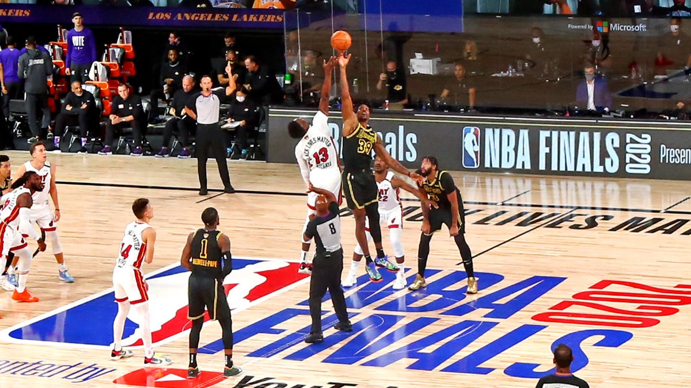
```


## **Research Questions**

* How does one work with a large amount tracking data?
* How does player position and speed at the moment of rebounding affect the probability of scoring points on the next play by the team that rebounded?
* How does the average speed of players (hustle) on opposing teams affect whether the next play generates points or not at the moment of rebound?


```{r echo=FALSE, out.width='60%', fig.cap="Tracking Data"}
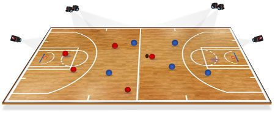
```

\vspace{.35in} <!-- this adds a bit of vertical space between the sections -->

## **Data**

* SportVU Data
* `nbastatR`
* 28 Ramdomly Sampled Games

```{r echo=FALSE, out.width='48%', fig.cap="Density of Total Rebounds Per Game"}
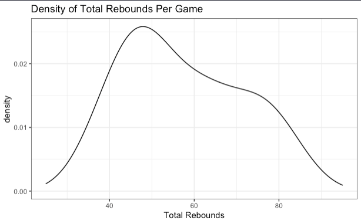
```


## **Previous Work**

* Miller's Possession Sketches
* Andruzzi's Position and Speed

```{r echo=FALSE, out.width='48%', fig.cap="Clustering Analysis Using Players Position and Speed"}
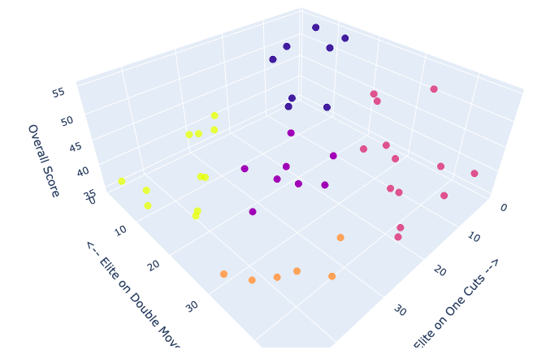
```


## **Initial Data Exploration**

Detroit Pistons vs. Atlanta Hawks


```{r echo=FALSE, out.width='60%', fig.cap="Movement of Bazemore and Ball for A Rebounding Event"}
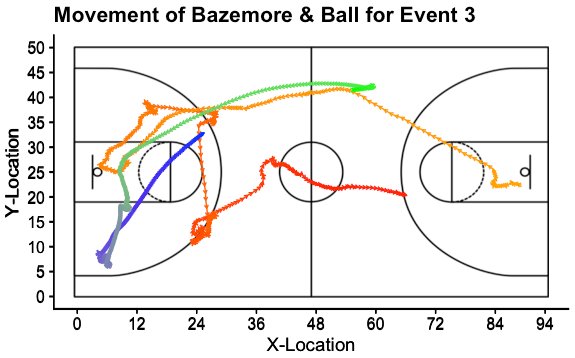
```

## **More Data Exploration**

Los Angeles Clippers vs. Memphis Grizzlies

```{r echo=FALSE, out.width='60%', fig.cap="Player Positions at Time of a Rebound Event"}
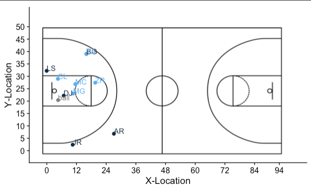
```

# Methods and Analysis

## **Wilcoxon Rank Sum Tests**

\begincols
\begincol{.5\textwidth}

```{r echo=FALSE, out.width='100%', fig.cap="Test Results for Position"}
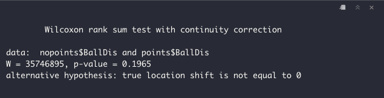
```

\endcol
\begincol{.5\textwidth}

```{r echo=FALSE, out.width='100%', fig.cap="Test Results for Speed"}
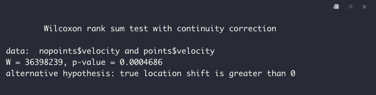
```

\endcol
\endcols

## **Logistic Modeling**

\begincols
\begincol{.5\textwidth}

```{r echo=FALSE, out.width='100%', fig.cap=""}
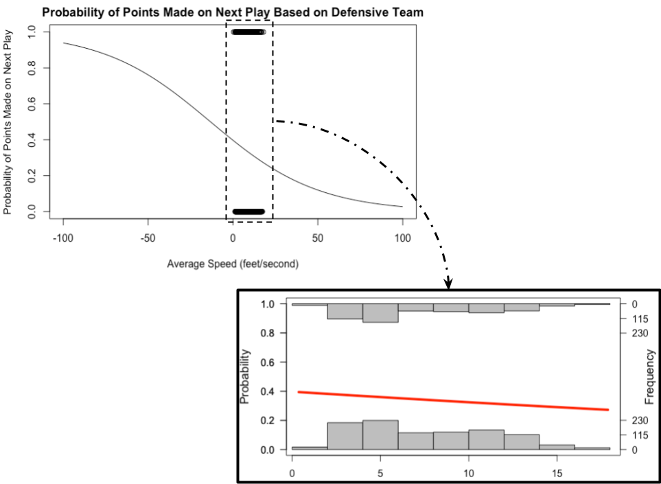
```

\endcol
\begincol{.5\textwidth}

```{r echo=FALSE, out.width='100%', fig.cap=""}
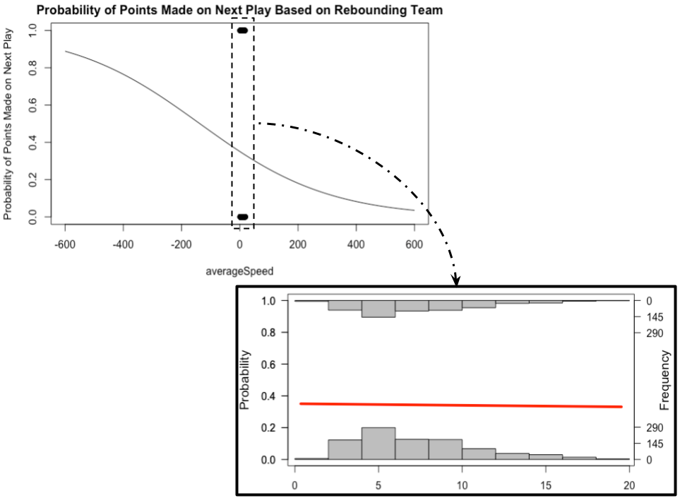
```

\endcol
\endcols

## **Difference**

```{r echo=FALSE, out.width='62%', fig.cap=""}
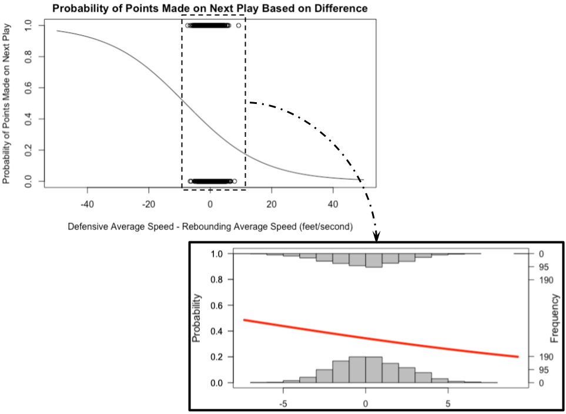
```

## **Summary of Results**

* Player distance to the ball did not a have a significant relationship with scoring points on the next play

* Speed of all 10 distinct players on the court had a significant relationship with scoring points on the next play

* Speed of players on the rebounding team did not translate to an increased likelihood of scoring on the next play

* Greater average speed of the rebounding team as well as the greater the difference of average speed for the defending team over the rebounding team led to significant, but relatively small, decreases on probability of scoring for the rebounding team


# Conclusion


## **Data Wrangling Challenges**

```{r echo=FALSE, out.width='70%', fig.cap="Big Data"}
knitr::include_graphics("analysisRMDs/pictures/pic7.jpeg")
```
 
## **Limitations**

* One season of data
* Offensive and defensive rebounds were not distinguished
* State of game during rebound varies widely

```{r echo=FALSE, out.width='35%', fig.cap="Limitations"}
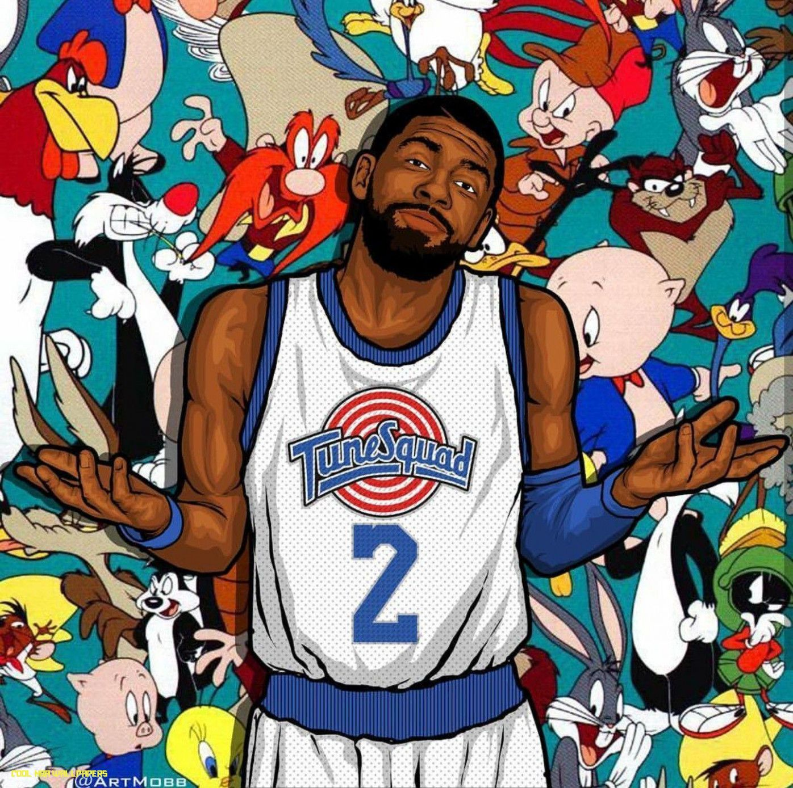
```

## **Extensions**

* Time left on shot clock and game
* Movement of the ball right after the rebound

```{r echo=FALSE, out.width='50%', fig.cap="Dame Time"}
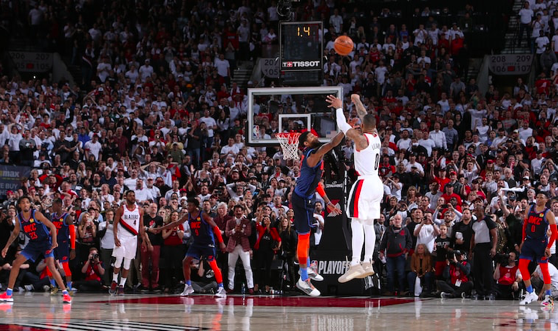
```

# REFERENCES

## Thank You

Hope you enjoyed our presentation!


<!-- don't delete and don't write below this line -->

## References


